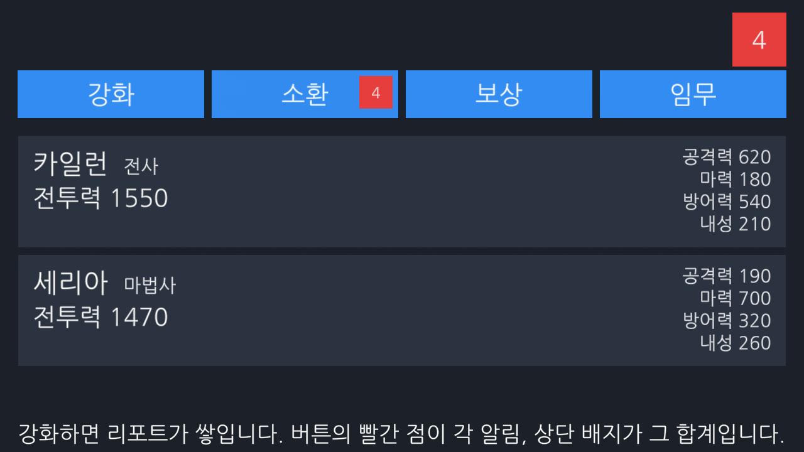
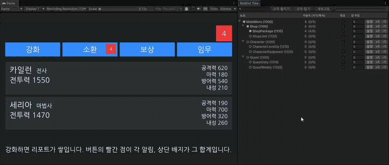

# 정휘현 - Unity Client Programmer

UI 시스템과 핵심 콘텐츠 시스템을 설계하고 라이브 서비스까지 운영해 온 Unity 클라이언트 프로그래머입니다.
상점, 결제, 재화, 캐릭터 스탯, 던전 진입 같은 시스템을 런칭부터 운영까지 맡았고,
기획팀과 아트팀이 코드 없이 쓸 수 있는 에디터 툴을 만드는 일에 강점이 있습니다.

경력 6년 8개월 - 애프터타임, IMC게임즈(트리 오브 세이비어M), 클로버게임즈(아야카시 라이즈).
세 프로젝트 모두 런칭과 라이브 운영을 함께 겪었습니다.

silsen@naver.com

---

## 먼저 볼 것 - 통합 데모

### [unity-integration-demo](https://github.com/Frenil-client/unity-integration-demo)

아래 UPM 패키지 세 개가 **서로를 모르는 채로** 하나의 화면에서 맞물리는 것을 보여주는 프로젝트입니다.
소재는 모바일 RPG 로비입니다.

`stat-system`은 `Observable`을 모르고, `mvvm`은 `Stat`을 모르며, `reddot-system`은 둘 다 모릅니다.
**한 패키지의 출력을 다른 패키지의 입력 타입으로 바꾸는 코드는 `Glue/` 두 파일뿐**이고,
그 둘을 지우면 세 패키지는 완전한 남남으로 돌아갑니다.
각 패키지 README가 "외부 의존 없는 드롭인"이라고 주장하기 때문에 세운 제약입니다.
연결 코드를 패키지 안에 넣는 순간 그 주장이 깨집니다.

Canvas도 GameObject도 만들지 않는 테스트 **21종**이 로비의 흐름 전체를 검증합니다.
`mvvm`이 ViewModel을 MonoBehaviour로 만들지 않은 이유가 여기서 증명됩니다.

패키지를 실제로 조립하는 과정에서 **패키지 쪽 결함 세 건**이 드러났고, 셋 다 데모가 아니라 패키지를
고쳐 해결했습니다. git URL 설치에서만 터지는 `.meta` 누락, 씬 오브젝트 순서에 따라 죽는 초기화 의존,
목록 항목 View가 프레임워크 기본 경로를 못 쓰던 문제입니다. 원인과 해결은
[데모 README](https://github.com/Frenil-client/unity-integration-demo#이-데모가-드러낸-것)에 정리했습니다.

---

## UI 시스템

### [unity-ui-system](https://github.com/Frenil-client/unity-ui-system)

Unity 6(uGUI) 기준으로 다시 쓴 UI 스택 관리 시스템입니다. 레이어 캔버스, 정렬 순서 자동 배정,
씬 소유권 기반 수명 관리를 한 덩어리로 묶어 게임 코드가
`UIManager.Instance.OpenAsync<T>()` 한 줄만 알면 되게 했습니다.

실무에서 UI 시스템을 만들 때마다 반복해서 밟았던 지뢰를 **구조로 막는 것**에 목표를 뒀습니다.

- **정렬 순서를 손으로 매기지 않습니다.** 레이어마다 커서를 두고 뷰가 가진 캔버스 수만큼 연속 구간을
  예약했다가 닫힐 때 반납합니다. `sortingOrder`를 프리팹에 박아 두고 나중에 겹치는 사고가 사라집니다.
- **레이어를 타입이 고정합니다.** `UIWindow`/`UIPopup`/`UIToast`가 자기 레이어와 Dim 사용 여부를
  `sealed override`로 못 박아, 프리팹마다 레이어를 잘못 찍는 실수가 애초에 불가능합니다.
- **영속 매니저가 씬을 붙잡지 않습니다.** 뷰마다 소유 씬을 기록하고 `sceneUnloaded`에서 스택과
  정렬 구간을 회수합니다. 씬보다 오래 사는 매니저에서 이 훅이 유일한 누수 방어선입니다.
- **부트스트랩 씬을 강제하지 않습니다.** 작업하던 씬에서 Play를 눌러도 영속 영역이 서기 때문에
  "초기화 씬부터 돌려야 UI가 뜬다"는 제약 없이 이터레이션이 끊기지 않습니다.

`UIScreen`만 `UIRoot`로 옮기지 않고 씬에 남긴 이유처럼(옮기면 루트 캔버스가 서브캔버스로 강등되면서
드리븐 RectTransform이 풀리고 자기 `CanvasScaler`가 죽습니다) **결정마다 근거와 그 대가를** README에
적었고, 아직 비어 있는 곳(테스트, 무결성 검사 툴, 토스트 자동 소멸)도 같은 자리에 그대로 두었습니다.

뼈대를 세운 단계입니다. v0.1.0 을 UPM 패키지로 잘라 냈고, 아래 패키지들과 달리 아직 CI 는 없습니다.

### 실제로 굴리고 있습니다

개인 게임 프로젝트 [DefenceGame](https://github.com/Frenil-client/DefenceGame) 에 git URL 로 설치해,
게임이 갖고 있던 UI 매니저를 걷어내고 이 패키지로 교체했습니다.
문자열 id 로 팝업을 열던 `Open("ShopPopup") as ShopPopup` 이 `OpenAsync<ShopPopup>()` 로 바뀌면서
오타가 런타임 로그가 아니라 컴파일 에러가 됐고, 팝업마다 깔던 반투명 backdrop 은 공유 Dim 하나로
대체돼 팝업이 겹쳐도 배경이 짙어지지 않습니다. 씬의 HUD 와 팝업이 같은 스택에 들어간 덕에
"결과창을 띄우기 전에 열려 있던 팝업만 정리" 같은 처리도 타입 인자 한 줄로 끝납니다.

조립하면서 드러난 마찰도 적어 둡니다. 셋 다 게임 쪽에서 우회했고 패키지는 아직 손대지 않았습니다.

- `UIBase.Close(reason = Dismissed)` 는 선택 인자가 있어 UnityEvent 에 직접 물리지 않습니다.
  닫기 버튼을 붙이려면 뷰마다 인자 없는 래퍼가 하나씩 필요합니다
- 인자 없는 `CloseAllAsync()` 는 스택 바닥의 `UIScreen` 까지 닫습니다. 팝업만 정리하려던 자리에서
  HUD 가 통째로 사라져서, 타입을 지정하는 `CloseAllAsync<UIPopup>()` 를 써야 했습니다
- `UILayerSettings` 의 기본 레퍼런스 해상도가 세로(1080x1920)라 가로 게임에서는 반드시 덮어써야 합니다.
  씬에 남는 `UIScreen` 은 자기 `CanvasScaler` 를 쓰기 때문에 이 값이 어긋나면 HUD 와 팝업의 배율이 갈라집니다

다음 버전에서 손볼 순서가 이 셋이고, 그 앞에 테스트와 CI 가 있습니다.

---

## 재사용 패키지 (UPM)

실무에서 설계했던 구조를 범용 모듈로 다시 구현했습니다. 셋 다 git URL로 설치되고,
**Unity 라이선스 없이 도는 CI**가 매 푸시마다 컴파일, 테스트, 할당 회귀를 검증합니다.

| 프로젝트 | 설명 | 테스트 | CI |
|---|---|---|---|
| [unity-mvvm](https://github.com/Frenil-client/unity-mvvm) | UGUI용 경량 MVVM. 외부 라이브러리 없이 `Observable<T>` 값 바인딩과 `ObservableList<T>` **델타 기반 목록 바인딩**. ViewModel은 Unity 비의존이라 화면 없이 테스트되고, 구독 수명은 베이스가 관리 | 38 |  |
| [unity-stat-system](https://github.com/Frenil-client/unity-stat-system) | 캐릭터 스탯 시스템. long 고정소수점 값 타입으로 결정적 연산, **기본값 + 모디파이어(장비/버프) 2층 구조**, 최종값 캐싱과 변경 통지 | 63 |  |
| [unity-reddot-system](https://github.com/Frenil-client/unity-reddot-system) | 트리 기반 레드닷. enum 숫자 규칙에서 계층 자동 유도, 델타 전파로 읽기 O(1), **트리 디버거 EditorWindow** 포함 | 47 |  |

### 수치로 남긴 것

**할당 19.07MB -> 0B** (stat-system)

`FieldInfo.GetValue()`가 struct를 호출마다 boxing하던 경로를 배열 인덱싱으로 재설계했습니다.
반복당 200바이트가 40바이트 박스 5개와 정확히 일치합니다.
[벤치마크 코드](https://github.com/Frenil-client/unity-stat-system/tree/main/Benchmarks~)가 리팩토링 전후
구현을 나란히 돌려 매번 다시 재고, **CI가 0바이트를 강제**하므로 문서가 낡을 수 없습니다.
Unity가 물결로 끝나는 폴더를 임포트하지 않기 때문에 벤치마크는 패키지 사용자에게 딸려가지 않습니다.

**boxed 열거자 40 B/회** (mvvm)

`ObservableList<T>`가 `List<T>.Enumerator`를 그대로 반환하는 이유를 인터페이스 경유 열거와
나란히 재서 숫자로 남겼습니다.

**float 대신 long 고정소수점** (stat-system)

부동소수점 결과는 플랫폼과 최적화 옵션에 따라 마지막 자리가 갈립니다. 표시용으로 끝나면 문제가
없지만 같은 계산을 서로 다른 곳에서 돌려 같은 답이 나와야 하는 순간부터는 재현 불가능한 불일치가
됩니다. 그래서 모든 산술을 정수 연산으로 닫아, 같은 입력이면 어느 환경에서든 비트 단위로 같습니다.

### CI 구성

Unity Personal 라이선스는 `.ulf`에 MAC 주소가 박힌 **하드웨어 바인딩**이라 매번 새로 만들어지는
GitHub 러너에서 활성화되지 않습니다. 자체 호스팅 러너는 공개 저장소에서 포크 PR이 임의 코드를
실행할 수 있어 선택지가 아니고요.

그래서 "CI에서 Unity를 돌린다"를 포기하는 대신 **테스트를 Unity 없이 돌 수 있게** 만들었습니다.
`Tests~/`의 dotnet 프로젝트가 `Tests/`의 소스를 **그대로 컴파일**하므로 사본이 아니라 같은 테스트이고,
패키지 세 개의 테스트 148종 중 **124종이 CI에서 실행**됩니다. 초록 뱃지가 실제로 무언가를 증명합니다.

빠지는 24종은 성격이 분명합니다. 할당을 재는 9종은 판정자(`Is.Not.AllocatingGCMemory`)가
`UnityEngine.TestTools` 소속이고, 나머지 15종은 실제로 `GameObject`를 만들어 View를 붙입니다.
둘 다 Unity 없이는 의미가 없어서 Test Runner에 남겼습니다.
CI가 검증하지 못하는 범위를 숨기지 않기 위해 적어 둡니다.

---

## 툴, 자동화, 구조 설계

| 프로젝트 | 설명 |
|---|---|
| [unity-maplightdata-tool](https://github.com/Frenil-client/unity-maplightdata-tool) | 씬별 조명 환경을 ScriptableObject로 관리. Primary/Additive 스택 기반 자동 복원, Addressables 에디터 자동화 |
| [minigames](https://github.com/Frenil-client/minigames) | 확장형 씬 로딩 플랫폼. 허브 씬에서 콘텐츠를 Additive 로드/언로드하고, 폴더 1개와 데이터 에셋 1개만 추가하면 코드 수정 없이 확장되는 구조. `IMiniGame` 생명주기 계약, ScriptableObject 데이터 드리븐 등록, UIStackManager, RecycleScrollView |

### 레드닷 트리 디버거

레드닷 버그는 대부분 "왜 안 켜지지" 또는 "왜 안 꺼지지" 한 문장으로 들어오는데, 원인은 셋 중 하나입니다.
값이 안 들어왔거나, 노드가 잠겨 있거나, enum 값을 잘못 매겨 부모에 안 붙었거나. 셋 다 런타임에서는
같은 증상으로만 드러납니다.

그래서 실효 카운트를 **자기와 자식으로 분해**해 보여주고(`5 (0/5)`는 내 값은 0인데 자식 때문에 켜졌다는
뜻입니다), 값 주입과 잠금 토글로 서버 응답 없이 UI 반응을 확인할 수 있게 하고, enum 계층의 구조적
실수까지 한 화면에 모았습니다.

표시 내용은 순수 C#이 만들고 창은 그리기만 하며, **런타임과 같은 계층 유도 함수를 쓴다는 전제를
테스트로 고정**했습니다. 툴과 실행 결과가 어긋나는 건 디버깅 도구가 만들 수 있는 최악의 실패라서입니다.

---

## 셰이더와 렌더링

Shader Graph 없이 HLSL을 직접 쓰고, 셰이더를 코드와 데이터로 제어하는 랩 두 개입니다.

| 프로젝트 | 설명 |
|---|---|
| [unity-spine-fx-lab](https://github.com/Frenil-client/unity-spine-fx-lab) | Spine 2D 런타임과 셰이더 제어. 디졸브, 히트플래시, 상태이상, 아웃라인을 MaterialPropertyBlock으로 머티리얼 증식 없이 일원 제어. **다중 인스턴스 58 -> 129 FPS**와 통합 투명 고스팅 두 건을 원인 분석부터 해결과 계측까지 정리. 오프스크린 컬링 기반 개선 포함 |
| [unity-urp-shader-lab](https://github.com/Frenil-client/unity-urp-shader-lab) | URP 기반 NPR 렌더링 랩. 셀 셰이딩, SDF 페이스 셰도우, 헤어 이방성, 아웃라인을 HLSL로 구현. SDF/스무딩 노멀 베이커 등 아트 파이프라인 툴 6종 자작 |

---

## 개인 게임 프로젝트 (R&D)

### [DefenceGame - SYNTHESIS (가칭)](https://github.com/Frenil-client/DefenceGame)

SD 서브컬처 랜덤 조합 디펜스 로그라이트. 기획부터 코어 아키텍처까지 1인으로 진행 중인 프로토타입입니다.
위 패키지에서 다진 원칙(Unity 비의존 순수 C# 코어, Unity 없이 도는 CI와 테스트)을
게임 한 편에 처음부터 적용하고 있습니다.

- **Unity 밖에서 도는 코어.** `Shared/Synthesis.Core`는 UnityEngine을 참조하지 않는 순수 C#이고,
  Unity 프로젝트와 콘솔이 junction으로 소스 한 벌을 공유합니다. 맵 생성, 스폰과 루프 순회, 배치,
  코스트, 조합은 시드 주입 PRNG와 정수 틱으로 닫아 재현 가능하게 두고, 전투는 실시간이라 이 범위 밖으로
  분리했습니다. 경계와 트레이드오프는 README에 그대로 남겼습니다.
- **문서가 아니라 게이트로 강제하는 검증.** CI가 커밋마다 코어의 UnityEngine 미참조를 grep과
  netstandard 빌드로 이중 차단하고, dotnet 테스트 41종과 CSV 불변식 린터가 우분투 러너에서 그대로 돕니다.
- **데이터 드리븐.** 유닛, 조합식, 웨이브, 보스, 스킬을 전부 `Data/*.csv`에 두고 수치를 코드에 박지 않습니다.
- **자기 패키지를 자기 게임이 씁니다.** UI 스택은 게임 코드에 두지 않고 위 unity-ui-system을
  UPM으로 설치해 씁니다. 게임이 갖고 있던 UI 매니저를 걷어내고 교체하는 과정에서 패키지 API의
  마찰 세 건이 드러났고, 목록은 위 UI 시스템 절에 적어 두었습니다.
- **되돌린 결정을 숨기지 않음.** 전투를 시뮬에서 실시간으로 들어낸 책임 경계 재설계,
  덱 시스템 폐기, 랜덤성을 확률이 아닌 재화(선택권)로 통제한 선택 등 근거와 함께 정리했습니다.

아트는 의도적으로 0입니다(로드맵상 재미 판정 전까지 아트 비용을 쓰지 않는 규칙). 그레이박스 상태에서
코어 아키텍처와 검증 파이프라인, 게임 디자인 판단을 증명하는 데 목적이 있습니다.

---

## 기술 스택

`Unity` `C#` `UGUI` `NGUI` `MVVM` `ScriptableObject` `Addressables` `Protobuf` `URP` `HLSL` `Spine` `UniTask` `DOTween` `GitHub Actions`
